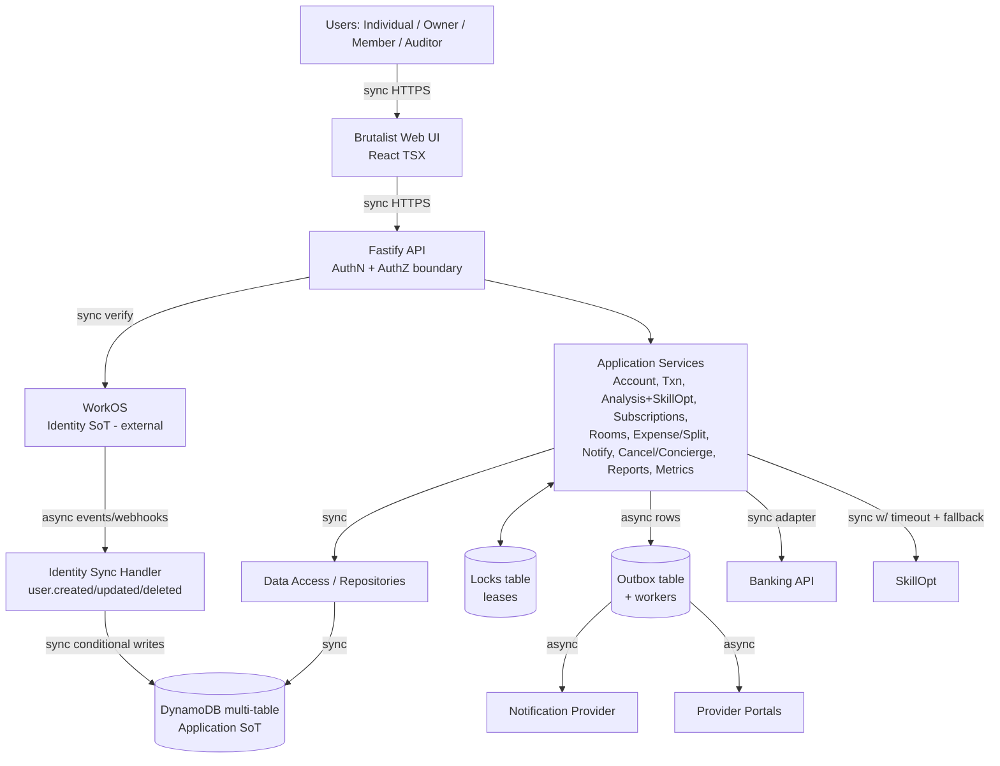

# RocketMoney — Architecture Baseline (M2, Approved 2026-09-27)

Evolves the Lab 3 layered architecture (Presentation → Application/Business → Integration →
Data Access → Persistence). Deployable unit: **layered modular monolith** (Fastify JS backend +
React TSX frontend). Event-driven behaviour is internal (Transactional Outbox + workers), not a
separate microservices estate. Full history: Lab 3 PDF `PES1UG24CS400_Lab3.pdf` in repo root.

## 1. Container view

Sync = request/response. Async = at-least-once + idempotent consumers (WorkOS events, outbox
workers). Exactly-once is never claimed.

## 2. Multi-table DynamoDB design (Q3 decision)

| Table | PK / SK | Purpose / key access patterns |
|---|---|---|
| `users` | `workosUserId` (PK) | App-user projection. Get profile; status lifecycle. Never passwords/secrets. |
| `rooms` | `roomId` (PK) | Room aggregate (name, ownerId, subscription link, settings, status incl. FROZEN). Get room; list rooms owned (GSI on `ownerId`). |
| `memberships` | `roomId` (PK) + `workosUserId` (SK) | Membership + role (OWNER/MEMBER). Get members; rooms-by-user (GSI on `workosUserId`). Conditional write on join prevents double-join. |
| `subscriptions` | `subscriptionId` (PK); GSI `ownerId` / `roomId` | Personal (`roomId` null) vs shared (`roomId` set). No duplication: a shared subscription is one row linked to the room. |
| `transactions` | `workosUserId` (PK) + `txnId` (SK) | Imported bank txns per user. Analysis scan scope. |
| `expenses` | `roomId` (PK) + `expenseId` (SK) | Immutable expense rows (amount, payer, participants, equal shares). Append-only. |
| `balances` | `roomId` (PK) + `pairKey` (SK, `debtor#creditor`) | Materialized pairwise balances, atomically updated with each expense/settlement under the room lock. |
| `settlements` | `roomId` (PK) + `settlementId` (SK) | Settlement requests/completions (status machine). |
| `invitations` | `token` (PK); GSI `roomId` | Opaque invite tokens (expiry, uses, revoked). No PII in token. |
| `outbox` | `eventId` (PK); GSI `status+nextAttempt` | Domain+outbox atomic rows; worker claim via conditional status flip. Poison → DLQ status + alert. |
| `locks` | `lockKey` (PK) | Lease locks (`owner`, `expiry`). Conditional acquire; expiry = crash safety. |
| `idempotency` | `key` (PK, TTL) | Financial-op + webhook-event dedupe. |

Atomic bundles (TransactWrite): expense-create = `expenses` put + `balances` updates + `outbox` put.
Settlement = `settlements` update + `balances` updates + `outbox` put. Membership-join =
`memberships` conditional put + `outbox` put. Single-aggregate writes use conditional single-item
writes. Hot-partition guard: room-scoped keys distribute by `roomId`; per-user tables by
`workosUserId`; no global monotonic keys.

## 3. WorkOS ↔ DynamoDB sync (Q1, Q2)

WorkOS = Identity SoT; DynamoDB `users` = application projection keyed by `workosUserId`
(`USER#<id>` style keys permitted as an alias, but the WorkOS ID is the stable reference; email is
never the join key). Webhook endpoint: verify signature → dedupe on WorkOS event ID
(`idempotency` table) → apply (`created` = conditional put; `updated` = version-guarded update;
`deleted/deactivated` = lifecycle transition, never blind delete).

**Q2 rule (binding):** owner exit requires designating a successor first (API rejects otherwise).
WorkOS-side disappearance without transfer → room `FROZEN` (reads allowed; writes to
expenses/settlements/invites rejected) + `RoomFrozen` outbox event + notification to members;
unfreeze on successor assignment. Balances, settlements, invites (revoked), and audit history are
retained in both paths. AuthN (WorkOS) ≠ AuthZ (room role); every room/resource op checks
membership + role server-side.

## 4. Locking + Outbox (summary)

Locks: `LOCK#ROOM#<id>`, `LOCK#SUB#<id>`, `LOCK#OUTBOX#<eventId>`; lease 10–30 s, no renewal except
long analysis jobs (heartbeat); contention → 409 + backoff; crash → expiry + version fencing.
Outbox flow: validate → lock → mutate + outbox row atomically → release → worker claims →
publish → idempotent consumer → external effect. Event catalogue: `SubscriptionDetected`,
`SubscriptionRenewalApproaching`, `RoomMemberJoined/Removed`, `RoomFrozen`, `ExpenseCreated/Updated`,
`SettlementRequested/Completed`, `CancellationRequested/Completed`, `ReportRequested`.

## 5. Rooms / Expense (MVP scope: equal-split only, hybrid ledger)

Room = id, name, owner, members/roles, subscription link, cost config, invites, settings, activity.
Owner caps: create, attach subscription, invite, manage members/splits, transfer ownership, cancel
workflows. Member caps: join, view share, record/pay expenses, view balances, settle, view activity.
Invitation: opaque token, expiry, single/multi-use + revocation, capacity + race guards.
Expense (MVP): amount, payer, participants, **equal split only**; shares materialized into
`balances` pairwise rows; settlements decrement atomically; `expenses`/`settlements` logs retained
for audit + rebuild.

## 6. SkillOpt boundary (Q6)

Adapter behind `RecurringAnalysisPort`; core analysis runs without SkillOpt (deterministic
fallback). SkillOpt path: sync call with timeout → fallback on failure/timeout. Evaluation:
wall-clock RTT + latency (p50/p95) of analysis invocations, SkillOpt vs baseline, logged per
invocation (request ID, outcome, duration; never secrets/PII).

## 7. Startup / shutdown / observability / security

Startup (fail-fast): config → env/secrets → WorkOS → DynamoDB → externals → listen; mandatory
failure = diagnostic (component, reason, retryable?) + non-zero exit. Shutdown (SIGTERM/SIGINT,
bounded timeout): stop intake → drain requests → stop worker intake → flush safe work → close
connections → exit; overrun = log + safe terminate. Logging keys: request ID, app user ID, room ID,
op, event/lock IDs, error category, duration, outcome. Never: passwords, secrets, tokens, raw bank
credentials, unnecessary financial PII. Banking = read-only; invite tokens opaque; financial ops
idempotent; room actions auditable; reports anonymized.

## 8. Traceability into M3+

Each ADR below maps to milestones M3 (detailed design) → M4 (MVP) → M5 (tests incl. concurrency
matrix: double-join, double-settle, double outbox delivery, lock expiry, worker crash) → M6/M7.
